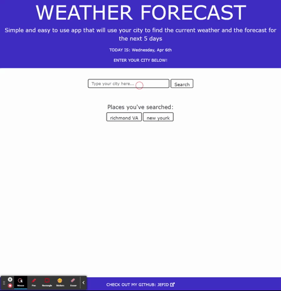

# weather-app

## Purpose
A website created with HTML/CSS/Javascript. It helps the user find the current weather forecast and the forecast for the next 5 days. Utilizes openweathermap API to find humidity, windspeed, UV index, and temperature.

## Preview
Here is a mock-up of how the page looks and functions.

</img>

## Built With
* HTML
* CSS
* Javascript
* openweathermap API

### This project was built to highlight skills using APIs 
Thanks for looking!

## Website
jefid.github.io/weather-app/

## Contribution
Made with ❤️ by Jefferson